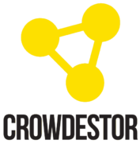

&nbsp;&nbsp;&nbsp;&nbsp;&nbsp;&nbsp;&nbsp;&nbsp;&nbsp;&nbsp;&nbsp;&nbsp;&nbsp;&nbsp;&nbsp;&nbsp;&nbsp;&nbsp;&nbsp;&nbsp;&nbsp;&nbsp;&nbsp;&nbsp;

# PortfolioScrapers
This repository contains Python3 scripts for scraping your account information from different investment platforms.
If a platform consists of separate projects the current value of the project will be found along with the total platform value(as a summation of project values).
Supports email notifications send from a supplied _Gmail_ to a receiver mail if the scraper failes to scrape a platform.

### Currently supportet platforms
* __BrickShare__ (Only supports scraping one BrickShare Project at the moment.)
* __Nordnet__
* __Mintos__ (__NB!__ Only works with Two-factor authentication __Deactivated__)
* __Peerberry__
* __Grupeer__
* __FastInvest__ (__NB!__ Only works with Two-factor authentication __Deactivated__)
* __Crowdestor__

### Prerequisites!
* Python 3
* pip3
* Install Selenium for Python3
* Install a Chrome/Chromium webdriver and supply the absolute path to the webdriver in ```utils/browser.py```
* Install pyvirtualdisplay by running: ```pip3 install pyvirtualdisplay```
* Install xvfb by running: ```apt-get install xvfb```

### Setup scraper
1. Create the file ```config.json``` in the root of the project (alongside portfolio\_scraper.py):
```
{
	"platforms_to_scrape": [
		"brickshare",
		"nordnet",
		"Mintos",
		"peerberry",
		"grupeer",
		"fastinvest",
		"crowdestor"
	],
	"alert_email": {
		"sender": {
			"usr": "some@gmail.com",
			"pwd": ""
		},
		"receiver": ""
	},
	"path_to_persist_data": "absolute/path/to/persist/data/",
	"accumulated_path": "absolute/path/to/accumulated/data/",
	"brickshare": {
		"usr": "",
		"pwd": "",
		"account": "some_account_id",
		"currency": "dkk",
		"projects": [
			"project-id"
		]
	},
	"nordnet": {
		"usr": "",
		"pwd": "",
		"account": "some_account_id",
		"currency": "dkk"
	},
	"mintos": {
		"usr": "",
		"pwd": "",
		"account": "mintos9623564",
		"currency": "eur"
	},
	"peerberry": {
		"usr": "",
		"pwd": "",
		"account": "some_account_id",
		"currency": "eur"
	},
	"grupeer": {
		"usr": "",
		"pwd": "",
		"account": "some_account_id",
		"currency": "eur"
	},
	"fastinvest": {
		"usr": "",
		"pwd": "",
		"account": "some_account_id",
		"currency": "eur"
	},
	"crowdestor": {
		"usr": "",
		"pwd": "",
		"account": "some_account_id",
		"currency": "eur"
	}
}

```
(__NB!__ ```alert_email.sender``` must be a _Gmail_)


### RUN
While at the root of the project, run the following command:
```
python3 portfolio_scraper.py
```

